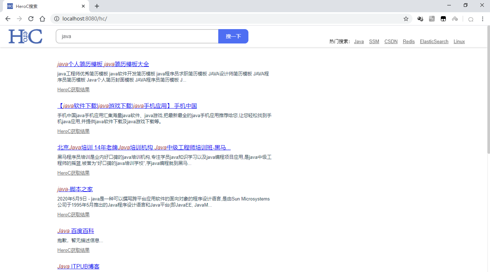
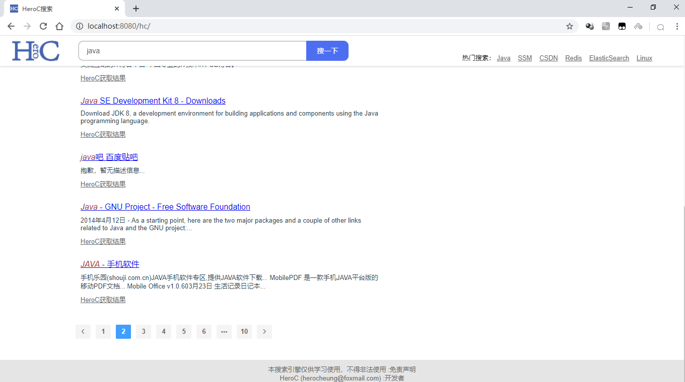

HC(HeroC)搜索

本项目使用前后分离的技术，实现**简单的搜索引擎**功能，通过获取百度搜索需要的数据，转存到ES索引库中，得到一定的数据量，帮助本项目的搜索功能实现。

---

**免责声明**：

本项目，只是本人本着学习的目的做的一个非常简单的搜索引擎项目，只供学习使用。

## 一、开发环境

开发软件：IDEA

前端框架：HTML/CSS/JS、Vue.js、ElementUI、Axios

后端框架：Spring、SpringMVC、Maven、ElasticSearch

后端有简单使用多线程技术，用于快速获取关键字在百度搜索中10页的数据。一个线程获取一页的数据，并存入索引库。

## 二、界面

> 首页

> 搜索页面顶部

> 搜索页面底部

